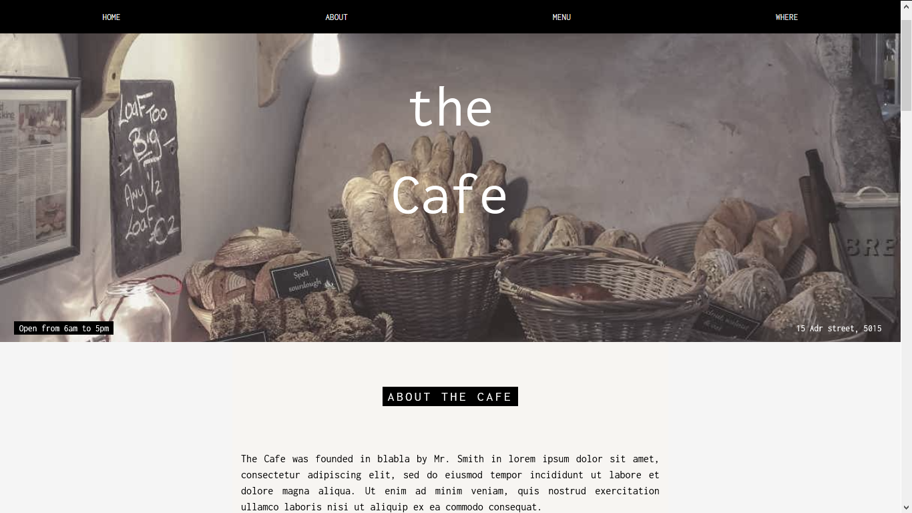
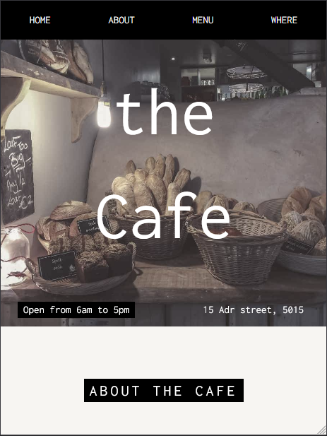
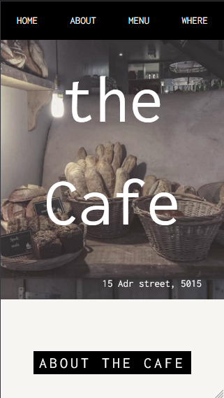

# Web Layout Project-coffeehouse
 
 This is a replica of the [coffeehouse](https://www.w3schools.com/w3css/tryit.asp?filename=tryw3css_templates_cafe) website layout from [W3School](https://www.w3schools.com/default.asp).

## About

 This is a project of a sample cafeteria designed from the W3school, and I recreated it for study proporses, just as a exercise to improve my skills.

## Desktop version

## Tablet version

## Mobile version

 ## License
 [MIT](https://choosealicense.com/licenses/mit/)
